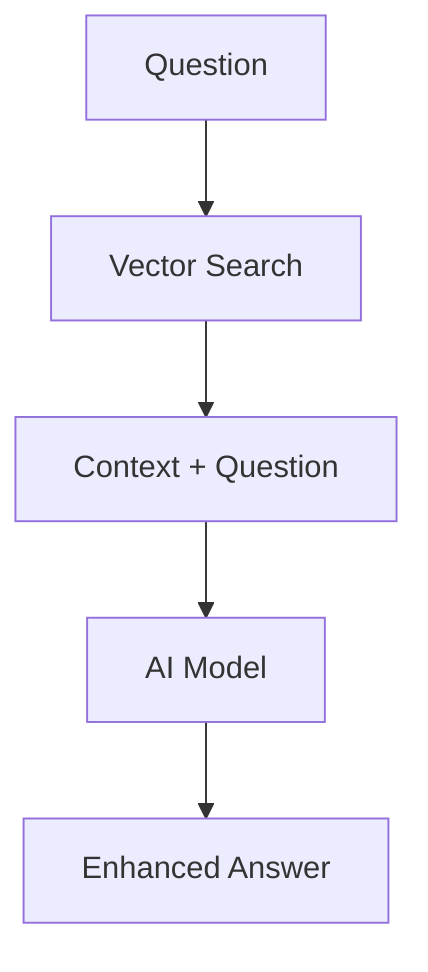
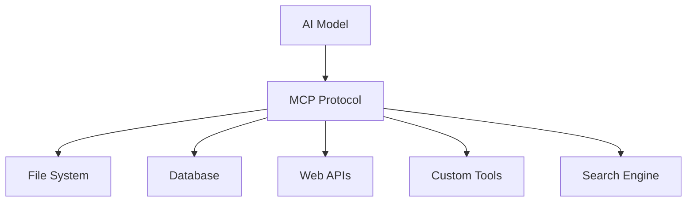

# Spring AI: Building Intelligent Applications

<div class="pt-12">
  <span @click="$slidev.nav.next" class="px-2 py-1 rounded cursor-pointer" hover="bg-white bg-opacity-10">
    From basic chat to advanced RAG and MCP <carbon:arrow-right class="inline"/>
  </span>
</div>

<div class="abs-br m-6 flex gap-2">
  <button @click="$slidev.nav.openInEditor()" title="Open in Editor" class="text-xl slidev-icon-btn opacity-50 !border-none !hover:text-white">
    <carbon:edit />
  </button>
  <a href="https://github.com/kousen/Spring_AI_Training_Course" target="_blank" alt="GitHub" title="Open in GitHub"
    class="text-xl slidev-icon-btn opacity-50 !border-none !hover:text-white">
    <carbon-logo-github />
  </a>
</div>

---

# Contact Info

Ken Kousen<br>
Kousen IT, Inc.

- ken.kousen@kousenit.com
- http://www.kousenit.com
- http://kousenit.org (blog)
- Social Media:
  - [@kenkousen](https://twitter.com/kenkousen) (Twitter)
  - [@kousenit.com](https://bsky.app/profile/kousenit.com) (Bluesky)
  - [https://www.linkedin.com/in/kenkousen/](https://www.linkedin.com/in/kenkousen/) (LinkedIn)
- *Tales from the jar side* (free newsletter)
  - https://kenkousen.substack.com
  - https://youtube.com/@talesfromthejarside

---
layout: two-cols
---

# What You'll Learn

<v-clicks>

- **Basic AI Integration**: ChatClient fundamentals
- **Streaming Responses**: Real-time AI interactions
- **Structured Data**: AI-powered object extraction
- **Multimodal AI**: Vision and audio capabilities
- **Function Calling**: Extend AI with custom tools
- **RAG Systems**: Knowledge-augmented AI
- **MCP Protocol**: Model Context Protocol implementation
- **Production Patterns**: Enterprise-ready architectures

</v-clicks>

::right::

<div class="mt-8">

</div>

<!-- Presenter notes: Emphasize hands-on nature, 15 progressive labs -->

---

# Repository Structure

```bash
Spring_AI_Training_Course/
├── labs.md             # 15 progressive lab exercises
├── src/
│   ├── main/java/      # Service implementations
│   ├── main/resources/ # Configuration & templates
│   └── test/java/      # Test-driven exercises
├── README.md           # Course documentation
└── slides.md           # This presentation
```

<v-clicks>

- **Start**: `main` branch with guided TODOs
- **Reference**: `solutions` branch when needed
- **Learn by doing**: Implement each lab incrementally
- **15 Labs**: From basic chat to advanced MCP servers

</v-clicks>

---

# Spring AI Ecosystem

<div class="grid grid-cols-3 gap-6">

<div>

## **AI Providers**

<v-clicks>

- OpenAI (GPT, DALL-E)
- Anthropic (Claude)
- Azure OpenAI
- Google Vertex AI
- Local models (Ollama)

</v-clicks>

</div>

<div>

## **Vector Stores**

<v-clicks>

- SimpleVectorStore (in-memory)
- Redis Vector Store  
- Pinecone, Weaviate
- PgVector, Chroma

</v-clicks>

</div>

<div>

## **Capabilities**

<v-clicks>

- Text generation
- Image analysis/generation
- Speech-to-text/text-to-speech
- Function calling
- RAG workflows

</v-clicks>

</div>

</div>

---

# Prerequisites

<div class="grid grid-cols-2 gap-8">

<div>

## Technical Requirements

<v-clicks>

- **Java 17+**
- **Spring Boot 3.5.8**
- **Spring AI 1.1.0**
- **Git** for branch management
- **Redis** (optional, for advanced RAG)

</v-clicks>

</div>

<div>

## Environment Setup

```bash
# Required API keys
export OPENAI_API_KEY=your_key
export ANTHROPIC_API_KEY=your_key

# Optional: Redis for advanced labs
docker run -p 6379:6379 redis/redis-stack:latest

# Clone and start
git clone <repo-url>
./gradlew build
./gradlew test
```

**Note:** Using `gpt-5-nano` and `claude-opus-4-1`

</div>

</div>

---
layout: section
---

# Lab 1-3: Foundations
## Building Your First AI-Powered Spring Application

---

# Lab 1: Basic Chat Interactions

````md magic-move
```java
// TODO: Create your first ChatClient
@Service
public class ChatService {
    // What goes here?
}
```

```java
// Step 1: Add ChatClient dependency
@Service
public class ChatService {
    private final ChatClient chatClient;
    
    // TODO: How do we use it?
}
```

```java
// Step 2: Complete implementation
@Service
public class ChatService {
    private final ChatClient chatClient;
    
    public ChatService(ChatClient.Builder builder) {
        this.chatClient = builder.build();
    }
    
    public String generateResponse(String prompt) {
        return chatClient.prompt(prompt)
            .call()
            .content();
    }
}
```
````

<v-click>

**Result**: AI-powered responses in your Spring application! 🎉

</v-click>

<!-- Presenter notes: Show live demo, explain auto-configuration -->

---

# Lab 2: Request/Response Logging

```java {1-5|7-12|14-18}
@Service
public class ChatService {
    private final ChatClient chatClient;
    
    public ChatService(ChatClient.Builder builder) {
        
        // Add logging advisor for debugging
        this.chatClient = builder
            .defaultAdvisors(new SimpleLoggerAdvisor())
            .build();
    }
    
    public String generateResponse(String prompt) {
        return chatClient.prompt(prompt)
            .call()
            .content();
    }
}
```

<v-click>

**Debug Output**: See exactly what's sent to and received from AI models

</v-click>

---

# Lab 3: Streaming Responses

```java {all|5-8|10-13}
@RestController
public class ChatController {
    
    @GetMapping(value = "/chat/stream", produces = MediaType.TEXT_EVENT_STREAM_VALUE)
    public Flux<String> streamChat(@RequestParam String message) {
        return chatClient.prompt(message)
            .stream()
            .content();
    }
    
    // Frontend receives real-time token-by-token responses
    // Perfect for chat interfaces and long AI responses
    // Uses Spring WebFlux Reactor streams
}
```

<v-click>

**Experience**: Real-time AI responses like ChatGPT interface

</v-click>

---
layout: section
---

# Lab 4-6: Structured AI
## From Text to Objects

---

# Lab 4: Structured Data Extraction

```java {1-4|6-10|12-16}
// Define your data structure
public record ActorFilms(String actor, List<String> movies) {}

@Test
void shouldGetActorFilms() {
    // AI converts natural language to structured data
    ActorFilms actorFilms = chatClient.prompt("Generate the filmography for Tom Hanks")
        .call()
        .entity(ActorFilms.class);
    
    // Assert AI returned proper structure
    assertThat(actorFilms.actor()).isEqualTo("Tom Hanks");
    assertThat(actorFilms.movies()).contains("Forrest Gump", "Cast Away");
}
```

<v-click>

**Magic**: AI understands your Java objects and populates them correctly!

</v-click>

---

# Lab 5: Prompt Templates

```java {1-6|8-14|16-20}
@Component
public class TemplateService {
    
    @Value("classpath:/prompts/actor-filmography.st")
    private Resource actorFilmographyTemplate;
    
    public ActorFilms getActorFilms(String actorName) {
        return chatClient.prompt()
            .user(userSpec -> userSpec
                .text(actorFilmographyTemplate)
                .param("actor", actorName)
                .param("count", 5))
            .call()
            .entity(ActorFilms.class);
    }
}
```

**Template File** (`actor-filmography.st`):
```
Generate a filmography for {actor}. 
Include exactly {count} of their most famous movies.
Format as JSON with actor name and movies array.
```

<!-- Presenter notes: Show StringTemplate syntax, parameter substitution -->

---

# Lab 6: Chat Memory

```java {1-8|10-16|18-22}
@Service
public class ConversationService {
    private final ChatClient chatClient;
    
    public ConversationService(ChatClient.Builder builder) {
        this.chatClient = builder
            .defaultAdvisors(new MessageChatMemoryAdvisor(
                new InMemoryChatMemory())) // Remembers conversation
            .build();
    }
    
    public String continueConversation(String message) {
        return chatClient.prompt(message)
            .call()
            .content();
        // AI remembers previous messages in this conversation!
    }
}
```

<v-click>

**Try this**: 
1. "My name is John"
2. "What's my name?" → "Your name is John"

</v-click>

---
layout: section
---

# Lab 7-9: Multimodal AI
## Beyond Text: Vision and Audio

---

# Lab 7: Vision Capabilities

```java {1-6|8-14|16-20}
@Test
void shouldAnalyzeImage() {
    var imageResource = new ClassPathResource(
        "/images/multimodal_test_image.png");
    
    String response = chatClient.prompt()
        .user(userSpec -> userSpec
            .text("What do you see in this image?")
            .media(MimeTypeUtils.IMAGE_PNG, imageResource))
        .call()
        .content();
    
    assertThat(response.toLowerCase())
        .contains("dog", "playing");
}
```

---

# Vision: What AI Can Analyze

<div class="grid grid-cols-2 gap-8">

<div>

<v-clicks>

- **Photos and diagrams**
- **Charts and graphs** 
- **Screenshots and UI mockups**
- **Medical images**
- **Technical drawings**

</v-clicks>

</div>

<div class="mt-4">

</div>

</div>

---

# Lab 8: Image Generation

```java {1-8|10-16|18-22}
@Service
public class ImageService {
    private final ImageModel imageModel;
    
    public ImageService(ImageModel imageModel) {
        this.imageModel = imageModel;
    }
    
    public String generateImage(String prompt) {
        ImageResponse response = imageModel.call(
            new ImagePrompt(prompt,
                ImageOptionsBuilder.builder()
                    .withModel("dall-e-3")
                    .withHeight(1024)
                    .withWidth(1024)
                    .build()));
        
        return response.getResult()
            .getOutput()
            .getUrl();
    }
}
```

<v-click>

**Create**: AI-generated images from text descriptions

</v-click>

---

# Lab 9: AI Tools (Function Calling)

````md magic-move
```java
// Step 1: Create a tool
@Component
public class DateTimeTools {
    @Tool("Get the current date and time")
    public String getCurrentDateTime() {
        return LocalDateTime.now().toString();
    }
}
```

```java
// Step 2: Register with ChatClient
@Service
public class ToolEnabledService {
    private final ChatClient chatClient;
    
    public ToolEnabledService(ChatClient.Builder builder, 
                              DateTimeTools dateTimeTools) {
        this.chatClient = builder
            .defaultTools(dateTimeTools)
            .build();
    }
}
```

```java
// Step 3: AI automatically calls your tools
@Test
void shouldCallTool() {
    String response = chatClient.prompt(
        "What time is it right now?")
        .call()
        .content();
    
    // AI called getCurrentDateTime() automatically!
    assertThat(response).contains("2024");
}
```
````

**Result**: AI can execute your Java methods when needed!

---
layout: section
---

# Lab 10-11: Audio Processing
## Speech-to-Text and Text-to-Speech

---

# Lab 10: Audio Transcription

```java {1-8|10-16|18-22}
@Service
public class AudioService {
    private final AudioTranscriptionModel transcriptionModel;
    
    public AudioService(AudioTranscriptionModel model) {
        this.transcriptionModel = model;
    }
    
    public String transcribeAudio(Resource audioFile) {
        AudioTranscriptionPrompt prompt = 
            new AudioTranscriptionPrompt(audioFile);
            
        AudioTranscriptionResponse response = 
            transcriptionModel.call(prompt);
            
        return response.getResult().getOutput();
    }
}
```

<v-click>

**Capability**: Convert speech files (MP3, WAV) to accurate text transcription

</v-click>

---

# Lab 11: Text-to-Speech

```java {1-8|10-16}
@Service
public class SpeechService {
    private final AudioSpeechModel speechModel;
    
    public SpeechService(AudioSpeechModel speechModel) {
        this.speechModel = speechModel;
    }
    
    public byte[] generateSpeech(String text) {
        AudioSpeechPrompt prompt = new AudioSpeechPrompt(text,
            AudioSpeechOptionsBuilder.builder()
                .withModel("tts-1")
                .withVoice(AudioSpeechOptions.Voice.ALLOY)
                .build());
                
        return speechModel.call(prompt).getResult().getOutput();
    }
}
```

---

# Text-to-Speech: Usage

```java
// Generate and save audio
byte[] audioData = speechService.generateSpeech(
    "Welcome to Spring AI training!");

// Save to file for playback
Files.write(Paths.get("welcome.mp3"), audioData);
```

<v-click>

**Output**: High-quality AI-generated speech from any text

</v-click>

---
layout: section
---

# Lab 12-13: RAG Systems
## Knowledge-Augmented AI

---

# Lab 12: The RAG Problem

<div class="grid grid-cols-2 gap-8">

<div>

## Traditional AI Limitations

<v-clicks>

- Knowledge cutoff dates
- Can't access your documents  
- No real-time information
- Generic responses only

</v-clicks>

</div>

<div>

## RAG Solution



</div>

</div>

---

# RAG: How It Works

<v-clicks>

1. **Document Processing**: Split documents into chunks
2. **Embedding Generation**: Convert chunks to vectors  
3. **Vector Storage**: Store in searchable database
4. **Query Processing**: Find relevant chunks for question
5. **Context Enhancement**: Add found content to AI prompt
6. **Enhanced Response**: AI answers using your data

</v-clicks>

<v-click>

**Result**: AI answers using YOUR documents and data! 🎯

</v-click>

---

# Spring AI: Supported Providers

<div class="grid grid-cols-3 gap-6">

<div>

## **Chat Models**

<v-clicks>

- OpenAI • Azure OpenAI
- Anthropic • Google VertexAI
- Amazon Bedrock • Ollama
- Hugging Face • Mistral AI
- Groq • NVIDIA • Perplexity
- DeepSeek • Moonshot AI
- QianFan • ZhiPu AI • MiniMax

</v-clicks>

</div>

<div>

## **Embedding Models**

<v-clicks>

- OpenAI • Azure OpenAI
- Amazon Bedrock • VertexAI
- Ollama • Mistral AI
- PostgresML • ONNX
- QianFan • ZhiPu AI
- OCI GenAI • MiniMax

</v-clicks>

</div>

<div>

## **Image & Audio**

<v-clicks>

- **Images**: OpenAI DALL-E
- **Images**: Stability AI, ZhiPu AI
- **Speech-to-Text**: OpenAI Whisper
- **Text-to-Speech**: OpenAI TTS
- **Moderation**: OpenAI, Mistral

</v-clicks>

</div>

</div>

**Spring AI advantage**: Portable API - switch providers with configuration only!

---

# Understanding Embeddings & Vector Search

<div class="grid grid-cols-2 gap-8">

<div>

## **What are Embeddings?**

<v-clicks>

- **Numerical representation** of text meaning
- **High-dimensional vectors** (typically 1536+ dimensions)
- **Semantic similarity** via distance calculations
- **Context-aware** - same words, different meanings

</v-clicks>

</div>

<div>

## **Chunking Strategies**

<v-clicks>

- **Token-based**: Split by token count (GPT tokenizer)
- **Sentence-based**: Preserve sentence boundaries
- **Semantic**: Split by topic/meaning changes
- **Overlapping**: Chunks share context at boundaries

</v-clicks>

</div>

</div>

---

# RAG Implementation

````md magic-move
```java
// Step 1: Document Processing
@Service
public class DocumentProcessor {
    public void loadDocuments(VectorStore vectorStore) {
        // Load PDF documents
        PagePdfDocumentReader pdfReader = 
            new PagePdfDocumentReader("classpath:/docs/spring-ai-reference.pdf");
        
        // Split into chunks
        TextSplitter splitter = new TokenTextSplitter();
        List<Document> documents = splitter.apply(pdfReader.get());
        
        // Store as vectors
        vectorStore.add(documents);
    }
}
```

```java
// Step 2: RAG Service
@Service
public class RAGService {
    private final ChatClient chatClient;
    private final VectorStore vectorStore;
    
    public String askQuestion(String question) {
        return chatClient.prompt()
            .advisors(new QuestionAnswerAdvisor(vectorStore))
            .user(question)
            .call()
            .content();
    }
}
```

```java
// Step 3: Testing RAG
@Test
void shouldAnswerFromDocuments() {
    String answer = ragService.askQuestion(
        "What is Spring AI ChatClient?");
    
    // AI uses loaded PDF content to answer!
    assertThat(answer).contains("ChatClient", "Spring AI");
}
```
````

**Magic**: AI answers questions using your PDF documents!

---

# Lab 13: Production RAG with Redis

```java {1-9|11-15}
@Configuration
@Profile("redis")  
public class RedisRAGConfig {
    
    @Bean
    public VectorStore redisVectorStore(EmbeddingModel embeddingModel) {
        // Spring AI 1.1.0 requires JedisPooled as first parameter
        return RedisVectorStore.builder(new JedisPooled("localhost", 6379), embeddingModel)
                .indexName("spring-ai-index")
                .initializeSchema(true)
                .build();
    }
    
    @Bean
    public ApplicationRunner dataLoader(VectorStore vectorStore) {
        return args -> loadDocumentsIfEmpty(vectorStore);
    }
}
```

---

# Redis RAG: Smart Data Loading

```java
@Bean
public ApplicationRunner dataLoader(VectorStore vectorStore) {
    return args -> {
        if (vectorStore instanceof RedisVectorStore redis && 
            redis.getCollection().isEmpty()) {
            
            // Only load documents if Redis is empty
            loadDocuments(vectorStore);
            log.info("Loaded {} documents into Redis", count);
        }
    };
}
```

**Benefits**: Persistent • Scalable • Fast similarity search

---
layout: section
---

# Lab 14-15: Model Context Protocol
## The Future of AI Tool Integration

---
layout: two-cols
---

# What is MCP?

<v-clicks>

- **Standardized protocol** for AI tool communication
- **Open source** by Anthropic
- **Universal interface** between AI and tools
- **Secure sandbox** for AI operations
- **Growing ecosystem** of MCP servers

</v-clicks>

::right::



<div class="mt-4 text-sm opacity-75">
MCP enables AI to securely access external tools and data sources
</div>

---

# Lab 14: MCP Client

```java {1-8|10-14}
@Service
@Profile("mcp")
public class McpClientService {
    private final ChatClient chatClient;
    
    public McpClientService(ChatClient.Builder builder) {
        // Spring AI auto-discovers MCP servers from config
        this.chatClient = builder.build();
    }
    
    public String executeWithTools(String request) {
        return chatClient.prompt(request).call().content();
        // AI can now use filesystem, search, etc.
    }
}
```

---

# MCP Client: Configuration

**Configuration** (`mcp-servers-config.json`):
```json
{
  "mcpServers": {
    "filesystem": {
      "command": "npx", 
      "args": ["-y", "@modelcontextprotocol/server-filesystem", "/tmp"]
    },
    "search": {
      "command": "npx",
      "args": ["-y", "@modelcontextprotocol/server-brave-search"]
    }
  }
}
```

**Result**: AI can access external tools through standardized protocol

---

# Lab 15: MCP Server

````md magic-move
```java
// Step 1: Create tools with @Tool annotation
@Service
public class CalculatorService {
    @Tool(description = "Add two numbers together")
    public double add(double a, double b) {
        return a + b;
    }
    
    @Tool(description = "Calculate compound interest")
    public double calculateCompoundInterest(
        double principal, double rate, int years) {
        return principal * Math.pow(1 + rate, years);
    }
}
```

```java
// Step 2: Spring AI auto-exposes as MCP server
@Configuration
@Profile("mcp-server")
public class McpServerConfig {
    // No explicit configuration needed!
    // @Tool annotated methods are automatically discovered
    
    @Bean
    public ApplicationRunner mcpServerLogger() {
        return args -> {
            System.out.println("MCP Server started with tools:");
            System.out.println("  • add(double, double) - Add numbers");
            System.out.println("  • calculateCompoundInterest(...) - Finance");
        };
    }
}
```

```bash
# Step 3: Run MCP server
./gradlew bootRun --args='--spring.profiles.active=mcp-server'

# Step 4: Connect from Claude Desktop
# Add to Claude's MCP config:
{
  "mcpServers": {
    "spring-calculator": {
      "command": "java",
      "args": ["-jar", "app.jar", "--spring.profiles.active=mcp-server"]
    }
  }
}
```
````

**Result**: Claude Desktop can use your Java methods as tools!

---
layout: section
---

# Production Patterns
## Enterprise-Ready Spring AI

---

# Service Layer: REST Controller

```java {1-6|8-16}
@RestController
@RequestMapping("/api/ai")
public class AIController {
    private final ChatService chatService;
    
    @PostMapping("/chat")
    public ResponseEntity<String> chat(@RequestBody ChatRequest request) {
        try {
            String response = chatService.generateResponse(request.getMessage());
            return ResponseEntity.ok(response);
        } catch (Exception e) {
            return ResponseEntity.status(500)
                .body("AI service temporarily unavailable");
        }
    }
```

---

# Service Layer: Streaming Support

```java {1-8|10-14}
@GetMapping("/chat/stream")
public ResponseEntity<Flux<String>> streamChat(@RequestParam String message) {
    Flux<String> stream = chatService.streamResponse(message)
        .onErrorReturn("Error occurred during streaming");
        
    return ResponseEntity.ok()
        .contentType(MediaType.TEXT_EVENT_STREAM)
        .body(stream);
}

// Clean separation of concerns
// Proper error handling
// Stream-ready architecture
// Production-ready patterns
```

---

# Configuration Management

```java {1-8|10-16}
@Configuration
public class AIConfiguration {
    
    @Bean
    @Primary
    @ConditionalOnProperty("spring.ai.openai.api-key")
    public ChatModel primaryChatModel(OpenAiChatModel openAiModel) {
        return openAiModel;
    }
    
    @Bean
    @ConditionalOnProfile("rag")
    public VectorStore vectorStore() {
        return new SimpleVectorStore();
    }
}
```

---

# Profile-Based Feature Activation

```java
@Bean
@Profile("redis")
public VectorStore redisVectorStore(EmbeddingModel embeddingModel) {
    return RedisVectorStore.builder(new JedisPooled("localhost", 6379), embeddingModel)
            .indexName("spring-ai-index")
            .initializeSchema(true)
            .build();
}

@Bean
@Profile("mcp")
public McpClientConfiguration mcpConfig() {
    return new McpClientConfiguration();
}
```

**Run configurations**:
```bash
./gradlew bootRun                                    # Basic AI
./gradlew bootRun --args='--spring.profiles.active=rag,redis'  # RAG
./gradlew bootRun --args='--spring.profiles.active=mcp'        # MCP
```

---

# Error Handling: Retries

```java {1-8|10-14}
@Service
public class ResilientChatService {
    private final ChatClient chatClient;
    
    @Retryable(value = {ApiException.class}, maxAttempts = 3)
    public String generateResponse(String prompt) {
        return chatClient.prompt(prompt).call().content();
    }
    
    // Automatically retries API failures
    // Exponential backoff available
    // Works with Spring Retry
}
```

---

# Error Handling: Circuit Breaker

```java {1-6|8-12}
@CircuitBreaker(name = "ai-service", fallbackMethod = "fallbackResponse")
public String generateResponseWithCircuitBreaker(String prompt) {
    return chatClient.prompt(prompt).call().content();
}

public String fallbackResponse(String prompt, Exception ex) {
    log.warn("AI service failed, using fallback", ex);
    return "I'm temporarily unable to process your request.";
}

// Prevents cascade failures
// Automatic recovery when service improves
```

---

# Error Handling: Async Processing

```java
@Async
public CompletableFuture<String> generateResponseAsync(String prompt) {
    return CompletableFuture.supplyAsync(() -> 
        chatClient.prompt(prompt).call().content());
}

// Usage
CompletableFuture<String> future = service.generateResponseAsync("Hello");
String result = future.get(30, TimeUnit.SECONDS);
```

**Benefits**: Non-blocking • Timeout control • Better UX

---

# Testing: Unit Tests with Mocks

```java {1-6|8-14}
@SpringBootTest
class ChatServiceTest {
    @MockitoBean ChatClient chatClient;
    @MockitoBean ChatClient.CallResponseSpec callSpec;
    
    @Test
    void shouldGenerateResponse() {
        when(chatClient.prompt("Hello")).thenReturn(callSpec);
        when(callSpec.call()).thenReturn(mockResponse("Hi there!"));
        
        String result = service.generateResponse("Hello");
        assertThat(result).isEqualTo("Hi there!");
    }
}
```

---

# Testing: Integration with TestContainers

```java {1-6|8-12}
@Testcontainers
@SpringBootTest
class RAGIntegrationTest {
    
    @Container
    static RedisContainer redis = new RedisContainer("redis:7.0")
        .withExposedPorts(6379);
        
    @Test
    void shouldPerformRAGWithRedis() {
        // Test actual RAG workflow with real Redis
        String answer = ragService.askQuestion("What is Spring AI?");
        assertThat(answer).contains("Spring", "AI");
    }
}
```

**Benefits**: Real dependencies • Isolated environments • CI/CD ready

---

# Cost & Performance Optimization

<div class="grid grid-cols-2 gap-8">

<div>

## **Model Selection**

<v-clicks>

- **GPT-4**: Complex reasoning, higher cost
- **GPT-3.5/4o**: Faster, cost-effective for simple tasks
- **Claude**: Strong for analysis, coding
- **Local models**: Privacy, no API costs

</v-clicks>

</div>

<div>

## **Optimization Strategies**

<v-clicks>

- **Token Management**: Monitor usage, optimize prompts
- **Embedding Caching**: Store frequently used vectors
- **Request Batching**: Combine operations when possible
- **Smart Chunking**: Optimize document splitting

</v-clicks>

</div>

</div>

---

# Security & Observability

<div class="grid grid-cols-2 gap-8">

<div>

## **Security Best Practices**

<v-clicks>

- **API Key Management**: Environment variables, vaults
- **Data Privacy**: Local processing when possible
- **Input Validation**: Sanitize user prompts
- **Output Filtering**: Check AI responses

</v-clicks>

</div>

<div>

## **Monitoring & Observability**

<v-clicks>

- **Logging**: All AI interactions and costs
- **Metrics**: Response times, token usage
- **Tracing**: Request flows through services
- **Alerting**: High costs, failed requests

</v-clicks>

</div>

</div>

---
layout: section
---

# Course Summary
## What You've Built

---

# Your AI-Powered Application Stack

<div class="grid grid-cols-2 gap-8">

<div>

## **Foundation & Advanced**

<v-clicks>

- ChatClient integration
- Multiple AI providers  
- Streaming responses
- Multimodal capabilities
- Function calling

</v-clicks>

</div>

<div>

## **Production Ready**

<v-clicks>

- RAG systems
- MCP protocol
- Service architecture
- Error handling
- Comprehensive testing

</v-clicks>

</div>

</div>

<v-click>

**Result**: Enterprise-grade Spring AI applications! 🚀

</v-click>

---

# Key Takeaways

<v-clicks>

1. **Spring AI simplifies AI integration** - No complex API calls or JSON parsing
2. **Start simple, add complexity gradually** - From basic chat to advanced RAG
3. **Leverage Spring's strengths** - Auto-configuration, profiles, testing
4. **Think beyond text** - Vision, audio, and structured data open new possibilities
5. **MCP is the future** - Standardized tool integration across AI platforms
6. **Production requires planning** - Error handling, monitoring, and resilience
7. **Test everything** - AI responses are non-deterministic but testable

</v-clicks>

---

# Next Steps: Continue Learning

<div class="grid grid-cols-2 gap-8">

<div>

## Hands-On Practice

<v-clicks>

- Explore the GitHub repository
- Try advanced RAG techniques  
- Build custom MCP servers
- Integrate with existing apps

</v-clicks>

</div>

<div>

## Key Resources

<v-clicks>

- [Spring AI Docs](https://docs.spring.io/spring-ai/reference/)
- [Model Context Protocol](https://modelcontextprotocol.io/)
- [Course Repository](https://github.com/kousen/Spring_AI_Training_Course)

</v-clicks>

</div>

</div>

---

# Production Considerations

<div class="grid grid-cols-2 gap-8">

<div>

## Operational Excellence

<v-clicks>

- **API Cost Management**: Monitor token usage
- **Rate Limiting**: Handle API quotas  
- **Data Privacy**: Keep sensitive data secure
- **Monitoring**: Track performance and errors

</v-clicks>

</div>

<div>

## Advanced Topics

<v-clicks>

- Custom embedding models
- Multi-agent systems
- AI-powered workflows
- Integration with existing systems

</v-clicks>

</div>

</div>

---

# Thank You!

<div class="text-center">

## Questions?

**Kenneth Kousen**  
*Author, Speaker, Java Champion*

[kousenit.com](https://kousenit.com) | [@kenkousen](https://twitter.com/kenkousen)

<div class="mt-8 mb-8">

</div>

### Ready to build intelligent applications with Spring AI!

**Repository**: [github.com/kousen/Spring_AI_Training_Course](https://github.com/kousen/Spring_AI_Training_Course)

</div>

<!-- Final presenter notes: 
- Emphasize hands-on nature of course
- Encourage students to continue with advanced topics
- Point to repository for continued learning
- Mention that solutions branch has all working code
-->